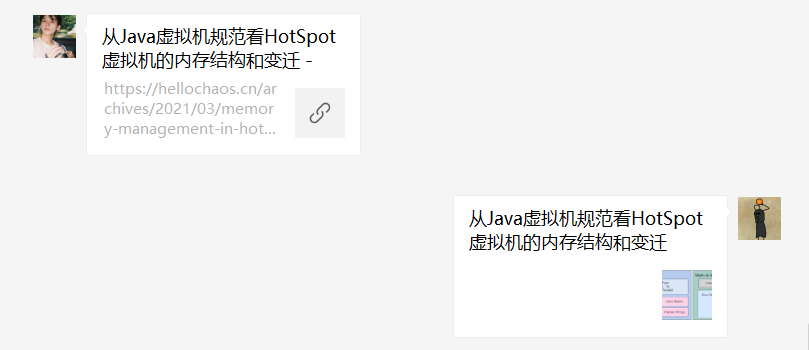

# Typecho微信分享插件 WeChatShare

## Overview

本插件来源于：[fuzqing](https://github.com/fuzqing)/**[WeChatShare](https://github.com/fuzqing/WeChatShare)** （原作者已不再维护，我针对最新的微信开放平台API做了修复）

使用此插件自定义微信分享链接中的标题、描述、小图标和URL，包括**分享给朋友/分享到朋友圈**，效果如下：

左边是原始的链接样式，右边是自定义后的链接样式

## Install

- 至[releases](https://github.com/misterchaos/WeChatShare/releases)中下载最新版本插件
- 将下载的压缩包进行解压，文件夹重命名为`WeChatShare`，上传至`Typecho`插件目录`usr/plugins`中
- 检查`WeChatShare`插件目录文件是否有读写权限，如果没有请增加
- 后台激活插件
- 到插件配置页面填写插件配置信息

## Usage

- 您需要有一个公众号，并且公众号通过微信认证
- 在插件中填写微信公众号平台中获取到的 `AppID` 和 `AppSecret` （开发 > 基本配置）
- 添加博客域名到`JS安全域名`中（设置 > 公众号设置 > 功能设置 > JS接口安全域名）
- 配置完成后，可以在每篇博客的编辑页面配置`微信分享`，设置标题、描述、小图标和URL等信息

## F&Q

- F：我暂时没有可用的微信公众号，怎么快速试用？
- A：可以使用开发者工具里面的`公众平台测试账号`，注意需要关注测试公众号才能生效
- F：如何调试我的网页，确认我的配置正确？
- A：推荐下载官方的`web开发者工具`，查看控制台信息
- F：在插件填写的配置信息为什么没有保存？
- A：先禁用，重新启用插件后再填写。这是原作者留下的BUG......我没去fix。

## License

The code is open source using GPL3 protocol. If you need to use the code, please follow the relevant provisions of CPL3 protocol.

## Authors

- Yuchao Huang [@misterchaos](https://github.com/misterchaos/) - Maintainer
- Fuzqing [@fuzqing](https://github.com/fuzqing) - Original Author

