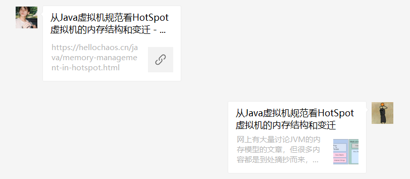

# Typecho微信分享插件 WeChatShare

## Overview

查看更详细的配置教程：[利用JS-SDK给Typecho微信分享链接带上自定义封面和简介](https://www.cnblogs.com/misterchaos/p/typecho-wechat-share-link.html)

使用此插件自定义微信分享链接中的标题、描述、小图标和URL，包括**分享给朋友/分享到朋友圈**，效果如下：



左边是原始的链接样式，右边是自定义后的链接样式

## Install

- 至[releases](https://github.com/misterchaos/WeChatShare/releases)中下载最新版本插件
- 将下载的压缩包进行解压，文件夹重命名为`WeChatShare`，上传至`Typecho`插件目录`usr/plugins`中
- 检查`WeChatShare`插件目录文件是否有读写权限，如果没有请增加
- 后台激活插件
- 到插件配置页面填写插件配置信息

## Usage

- 您需要有一个公众号，并且公众号通过微信认证
- 在插件中填写微信公众号平台中获取到的 `AppID` 和 `AppSecret` （开发 > 基本配置）
- 添加博客域名到`JS安全域名`中（设置 > 公众号设置 > 功能设置 > JS接口安全域名）
- 配置完成后，可以在每篇博客的编辑页面配置`微信分享`，设置标题、描述、小图标和URL等信息

## Pjax 

如果你的网站使用了`pjax`技术，则需要进行下一步的设置，否则在页面发生跳转后插件将无法正常工作。

### 1. 在你的`pjax-container`中添加以下代码

下面代码的作用是在完成`pjax`刷新之后，替换成新的文章信息

```php
    <script>
        var pageInfo = {
            title: '<?php echo $this->title; ?>',
            parameter_type: '<?php echo $this->parameter->type; ?>',
            cid: '<?php echo $this->cid; ?>',
            signature_url: '<?php
                $http_type = ((isset($_SERVER['HTTPS']) && $_SERVER['HTTPS'] == 'on')
                    || (isset($_SERVER['HTTP_X_FORWARDED_PROTO'])
                        && $_SERVER['HTTP_X_FORWARDED_PROTO'] == 'https')) ? 'https://' : 'http://';
                $signature_url = $http_type . $_SERVER['HTTP_HOST'] . $_SERVER['REQUEST_URI'];
                // pjax
                $signature_url = preg_replace('/\?_pjax=.*/','',$signature_url);
                echo $signature_url; ?>'
        };
    </script>
```

### 2. 在你的`pjax`回调函数中添加以下代码

下面代码的作用是在`pjax`刷新之后重新调用`wx.config`

```javascript
new WX_Custom_Share().init();
```

### 3. 我的`pjax`代码示例

我的`pjax`代码如下：

```javascript
$(document).pjax('a[href*="<?php Helper::options()->siteUrl()?>"]:not(a[target="_blank"], a[no-pjax])', {
        container: '#content',
        fragment: '#content',
        timeout: 8000
}).on('pjax:send', function () {
        // some animate code......
}).on('pjax:complete',
        function () {
        // 微信分享插件
        new WX_Custom_Share().init();
});
```

其中设置了`#content`为pjax容器，因此我向该`div`中添加代码：

```php
<div id="content" class="app-content">
    <script>
        // 第一步中给出的代码
    </script>
```

然后我在上面的`pjax`回调中添加了`new WX_Custom_Share().init();`，即可完成`pjax`的配置

## FAQ

- Q：我暂时没有可用的微信公众号，怎么快速试用？
- A：可以使用开发者工具里面的`公众平台测试账号`，注意需要关注测试公众号才能生效
- Q：如何调试我的网页，确认我的配置正确？
- A：推荐下载官方的`web开发者工具`，查看控制台信息
- Q：在插件填写的配置信息为什么没有保存？
- A：先禁用，重新启用插件后再填写。这是原作者留下的BUG......我没去fix。

## License

The code is open source using GPL3 protocol. If you need to use the code, please follow the relevant provisions of CPL3 protocol.

## Authors

- Yuchao Huang [@misterchaos](https://github.com/misterchaos/) - Maintainer
- Fuzqing [@fuzqing](https://github.com/fuzqing) - Original Author

## Thanks

本插件的原始代码来源于：[fuzqing](https://github.com/fuzqing)/**[WeChatShare](https://github.com/fuzqing/WeChatShare)** 

原作者已不再维护，我针对最新的微信开放平台API做了修复和升级